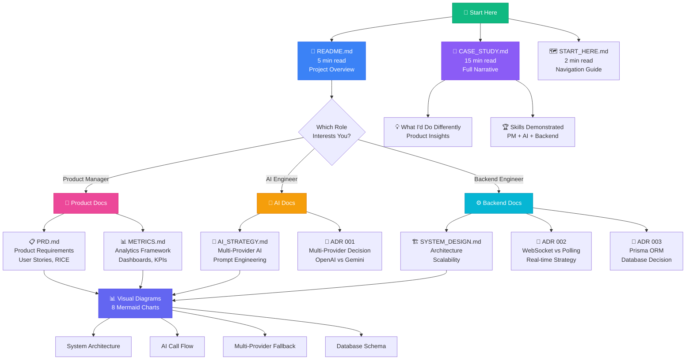

# 🗺️ Portfolio Documentation Map

**Visual guide to navigating this portfolio based on your interests.**

---

## Portfolio Navigation Diagram



---

## 📚 Document Hierarchy

```
Mohit-AI-Backend/
│
├── 🚀 ENTRY POINTS (Start Here)
│   ├── README.md ⭐⭐⭐ [5 min] Product showcase
│   ├── CASE_STUDY.md ⭐⭐ [15 min] Full project story
│   └── docs/START_HERE.md ⭐ [2 min] Role-based nav
│
├── 👔 PRODUCT MANAGEMENT
│   └── docs/product/
│       ├── PRD.md [30 min] Product requirements
│       └── METRICS.md [20 min] Analytics framework
│
├── 🤖 AI ENGINEERING
│   └── docs/ai-engineering/
│       └── AI_STRATEGY.md [25 min] AI architecture
│
├── ⚙️ BACKEND ENGINEERING
│   └── docs/architecture/
│       └── SYSTEM_DESIGN.md [30 min] System architecture
│
├── 📝 DECISIONS (ADRs)
│   └── docs/decisions/
│       ├── 001-multi-provider-ai-strategy.md [10 min]
│       ├── 002-websocket-vs-polling.md [10 min]
│       └── 003-prisma-orm-choice.md [10 min]
│
└── 📊 VISUAL DIAGRAMS
    └── docs/diagrams/
        ├── system-architecture.md [8 diagrams]
        └── README.md [Diagram guide]
```

---

## ⏱️ Reading Time Estimates

### Quick Tour (30 minutes)
Perfect for busy hiring managers or initial screening:

1. **README.md** (5 min) - Project overview
2. **CASE_STUDY.md** - Skim intro + "Skills Demonstrated" section (10 min)
3. **One ADR** based on interest (10 min)
4. **Visual Diagrams** - Browse 2-3 key diagrams (5 min)

**You'll Learn:** What this project is, key skills demonstrated, one deep technical decision

---

### Deep Dive by Role (1-2 hours)

#### For Product Manager Role

**Path 1: Product Strategy (60 minutes)**
1. README.md → "The Problem" section (5 min)
2. PRD.md → Full read (30 min)
3. METRICS.md → Skim dashboards section (15 min)
4. CASE_STUDY.md → "Product Strategy" section (10 min)

**You'll Learn:** How I research markets, write PRDs, design metrics frameworks

---

#### For AI Engineer Role

**Path 2: AI Architecture (75 minutes)**
1. README.md → "Multi-Provider AI Architecture" section (5 min)
2. AI_STRATEGY.md → Full read (25 min)
3. ADR 001: Multi-Provider AI (15 min)
4. Visual Diagrams → AI Fallback + Cost Optimization (10 min)
5. CASE_STUDY.md → "AI Engineering" section (20 min)

**You'll Learn:** Multi-provider strategy, prompt engineering, cost optimization ($0.68 → $0.42/call)

---

#### For Backend Engineer Role

**Path 3: System Architecture (90 minutes)**
1. README.md → "System Architecture Highlights" (5 min)
2. SYSTEM_DESIGN.md → Full read (30 min)
3. ADR 002: WebSocket vs Polling (10 min)
4. ADR 003: Prisma ORM (10 min)
5. Visual Diagrams → System Architecture + Scaling (15 min)
6. Database Schema in diagrams (10 min)
7. CASE_STUDY.md → "Technical Architecture" section (10 min)

**You'll Learn:** Scalability strategy, real-time architecture, database design, performance optimization

---

## 🎯 Document Purpose Matrix

| Document | PM Skills | AI Skills | Backend Skills | Time |
|----------|-----------|-----------|----------------|------|
| README.md | ⭐⭐⭐ | ⭐⭐ | ⭐⭐ | 5 min |
| CASE_STUDY.md | ⭐⭐⭐ | ⭐⭐⭐ | ⭐⭐⭐ | 15 min |
| PRD.md | ⭐⭐⭐⭐⭐ | ⭐ | ⭐ | 30 min |
| METRICS.md | ⭐⭐⭐⭐⭐ | ⭐⭐ | ⭐⭐ | 20 min |
| AI_STRATEGY.md | ⭐⭐ | ⭐⭐⭐⭐⭐ | ⭐⭐ | 25 min |
| SYSTEM_DESIGN.md | ⭐⭐ | ⭐⭐ | ⭐⭐⭐⭐⭐ | 30 min |
| ADR 001 (AI) | ⭐⭐ | ⭐⭐⭐⭐⭐ | ⭐⭐⭐ | 10 min |
| ADR 002 (WebSocket) | ⭐ | ⭐⭐ | ⭐⭐⭐⭐⭐ | 10 min |
| ADR 003 (Prisma) | ⭐ | ⭐ | ⭐⭐⭐⭐⭐ | 10 min |
| Visual Diagrams | ⭐⭐⭐ | ⭐⭐⭐⭐ | ⭐⭐⭐⭐⭐ | 5-15 min |

**Legend:** ⭐ = Minimal relevance, ⭐⭐⭐⭐⭐ = Core skill demonstration

---

## 🔍 Finding Specific Topics

### Looking for...

**"How does the AI fallback work?"**
→ [AI_STRATEGY.md § Multi-Provider Fallback](./ai-engineering/AI_STRATEGY.md#multi-provider-fallback-architecture)
→ [ADR 001](./decisions/001-multi-provider-ai-strategy.md)
→ [Diagram: AI Fallback Flow](./diagrams/system-architecture.md#3-multi-provider-ai-fallback-architecture)

**"How do you handle real-time updates?"**
→ [SYSTEM_DESIGN.md § WebSocket Server](./architecture/SYSTEM_DESIGN.md#2-websocket-server-socketio)
→ [ADR 002](./decisions/002-websocket-vs-polling.md)
→ [Diagram: WebSocket Architecture](./diagrams/system-architecture.md#4-real-time-websocket-architecture)

**"What metrics do you track?"**
→ [METRICS.md § North Star Metric](./product/METRICS.md#north-star-metric)
→ [METRICS.md § Dashboard Mockups](./product/METRICS.md#dashboard-mockups-proposed-views)

**"How did you optimize AI costs?"**
→ [AI_STRATEGY.md § Cost Optimization](./ai-engineering/AI_STRATEGY.md#cost-optimization-strategies)
→ [Diagram: Cost Optimization Flow](./diagrams/system-architecture.md#8-cost-optimization-flow-ai-calls)

**"How would this scale to 10,000 users?"**
→ [SYSTEM_DESIGN.md § Scalability Analysis](./architecture/SYSTEM_DESIGN.md#scalability-analysis)
→ [Diagram: Horizontal Scaling](./diagrams/system-architecture.md#7-horizontal-scaling-architecture)

**"What product decisions did you make?"**
→ [PRD.md § Product Strategy](./product/PRD.md#goals--success-criteria)
→ [CASE_STUDY.md § Product Thinking](../CASE_STUDY.md#product-strategy-voice-first-ai-with-human-handoff)

---

## 💡 Pro Tips for Reviewers

### Evaluating Product Skills?
**Focus on:** PRD.md (user stories, RICE scoring) + METRICS.md (North Star metric, dashboards)
**Skip:** Technical ADRs, system design deep-dives
**Time:** 45 minutes

### Evaluating AI Engineering?
**Focus on:** AI_STRATEGY.md + ADR 001 + Cost optimization diagrams
**Skip:** Database schema, backend scaling details
**Time:** 40 minutes

### Evaluating Backend Engineering?
**Focus on:** SYSTEM_DESIGN.md + ADR 002 & 003 + Architecture diagrams
**Skip:** PRD details, product metrics
**Time:** 50 minutes

### Want the Full Picture?
**Read in Order:**
1. README.md (5 min)
2. CASE_STUDY.md (15 min)
3. Pick 2-3 docs based on role focus (60 min)
4. Browse visual diagrams (10 min)
**Total:** ~90 minutes for comprehensive review

---

## 📞 Questions?

If you're reviewing this portfolio and have questions:

**Mohit Tiwari**
- 📧 Email: mohit@mohit-ai.com
- 💼 LinkedIn: [linkedin.com/in/mohittiwari](https://linkedin.com/in/mohittiwari)
- 🐙 GitHub: [github.com/Mohit4022-cloud](https://github.com/Mohit4022-cloud)

**Common Questions Answered:**
- "Is this real?" → See CASE_STUDY.md intro (honest about portfolio nature)
- "Can I see the code?" → `/src` directory has full implementation
- "What's your best work here?" → Multi-provider AI fallback (shows production thinking)

---

*Last Updated: October 17, 2025*
