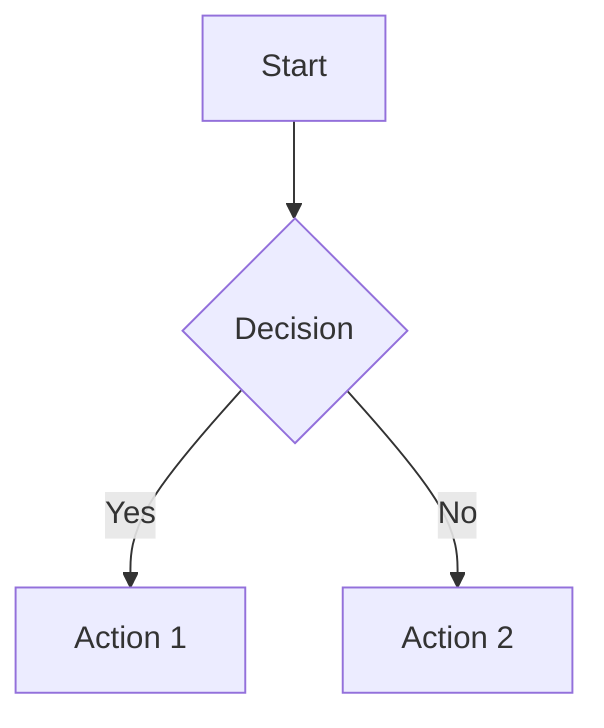
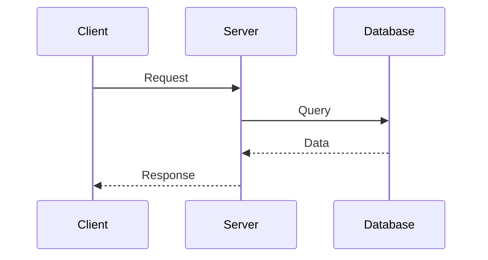
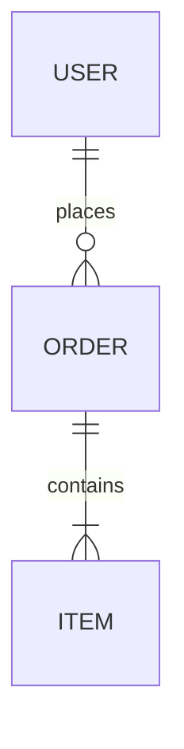

# Visual Architecture Diagrams

This directory contains comprehensive visual diagrams for the Mohit AI platform using Mermaid syntax (renders automatically on GitHub).

---

## 📊 Available Diagrams

### 1. [System Architecture Diagrams](./system-architecture.md)

**8 Complete Diagrams:**

| # | Diagram | Purpose | Best For |
|---|---------|---------|----------|
| 1 | **High-Level System Architecture** | Full stack overview | Understanding overall system |
| 2 | **AI Call Flow (Sequence)** | Lead → AI Call → CRM update | Following data flow |
| 3 | **Multi-Provider AI Fallback** | Provider switching logic | AI reliability strategy |
| 4 | **Real-Time WebSocket Architecture** | Socket.io rooms & events | Real-time communication |
| 5 | **Database Schema (ER Diagram)** | Core entities & relationships | Data modeling |
| 6 | **Background Job Queue** | Bull queue architecture | Async processing |
| 7 | **Horizontal Scaling** | Multi-instance deployment | Scalability planning |
| 8 | **Cost Optimization Flow** | AI cost decision tree | Understanding cost strategy |

---

## 🚀 Quick Links

### For Product Managers:
- [AI Call Flow](./system-architecture.md#2-ai-call-flow-lead-submission--ai-call--crm-update) - Shows user journey through system
- [High-Level Architecture](./system-architecture.md#1-high-level-system-architecture) - Big picture

### For AI Engineers:
- [Multi-Provider AI Fallback](./system-architecture.md#3-multi-provider-ai-fallback-architecture) - Resilience strategy
- [Cost Optimization Flow](./system-architecture.md#8-cost-optimization-flow-ai-calls) - $0.68 → $0.42 per call

### For Backend Engineers:
- [System Architecture](./system-architecture.md#1-high-level-system-architecture) - Full stack
- [Database Schema](./system-architecture.md#5-database-schema-core-entities) - Data model
- [Horizontal Scaling](./system-architecture.md#7-horizontal-scaling-architecture) - Scale strategy

---

## 💡 How to Use

### View on GitHub
1. Open any `.md` file in this directory on GitHub
2. Diagrams render automatically (Mermaid support built-in)

### Export as Images
1. Copy Mermaid code from diagram
2. Go to [Mermaid Live Editor](https://mermaid.live/)
3. Paste code
4. Export as PNG/SVG

### Embed in Presentations
1. Export diagram as PNG (high resolution)
2. Use in slides, pitch decks, or technical docs

---

## 🎨 Diagram Legend

| Color | Meaning | Example |
|-------|---------|---------|
| 🟢 Green | Success, cached, optimized | OpenAI success, cache hit |
| 🔵 Blue | External service, database | Google Gemini, PostgreSQL |
| 🟡 Yellow | Warning, medium priority | Medium-priority queue |
| 🔴 Red | Error, high priority, alert | Circuit breaker triggered |
| 🟣 Purple | Real-time, WebSocket | Socket.io events |
| 🟠 Orange | Infrastructure, AWS | Load balancer, ALB |

---

## 📝 Creating New Diagrams

### Mermaid Syntax Examples

**Flowchart:**

**Sequence Diagram:**

**Entity Relationship:**

**Learn More:** [Mermaid Documentation](https://mermaid.js.org/intro/)

---

## 🔗 Referenced In Documentation

These diagrams are linked from:
- [README.md](../../README.md#-system-architecture-highlights)
- [System Design](../architecture/SYSTEM_DESIGN.md)
- [AI Strategy](../ai-engineering/AI_STRATEGY.md)
- [Case Study](../../CASE_STUDY.md)

---

## 🤝 Contributing

To add new diagrams:
1. Use Mermaid syntax for GitHub compatibility
2. Follow existing naming conventions
3. Add color coding per legend
4. Update this README with new diagram entry
5. Link from relevant documentation

---

*Last Updated: October 17, 2025*
