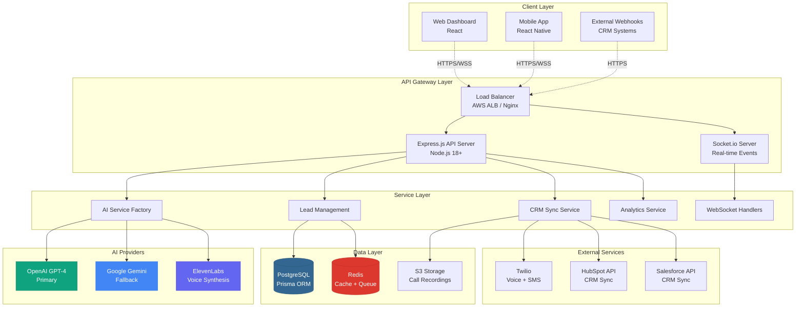
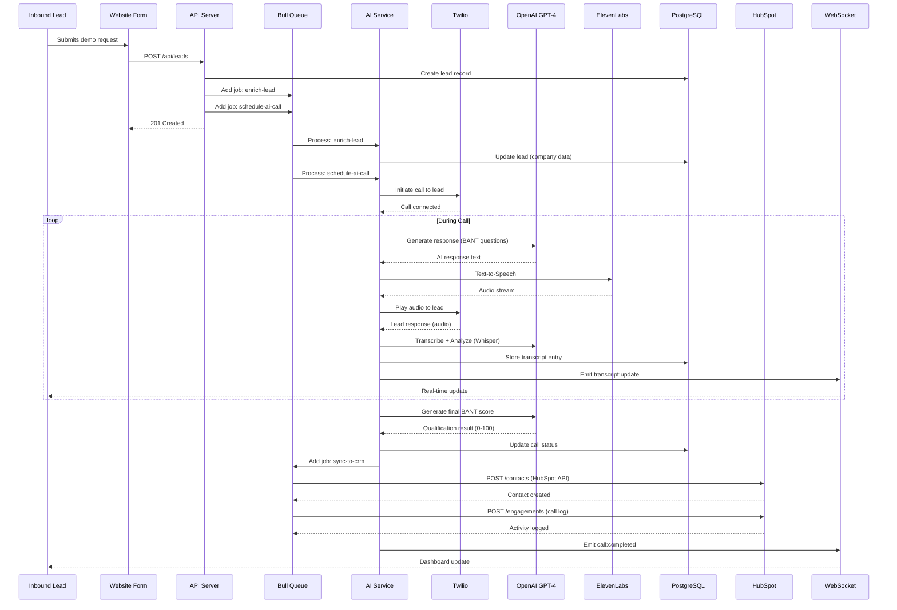
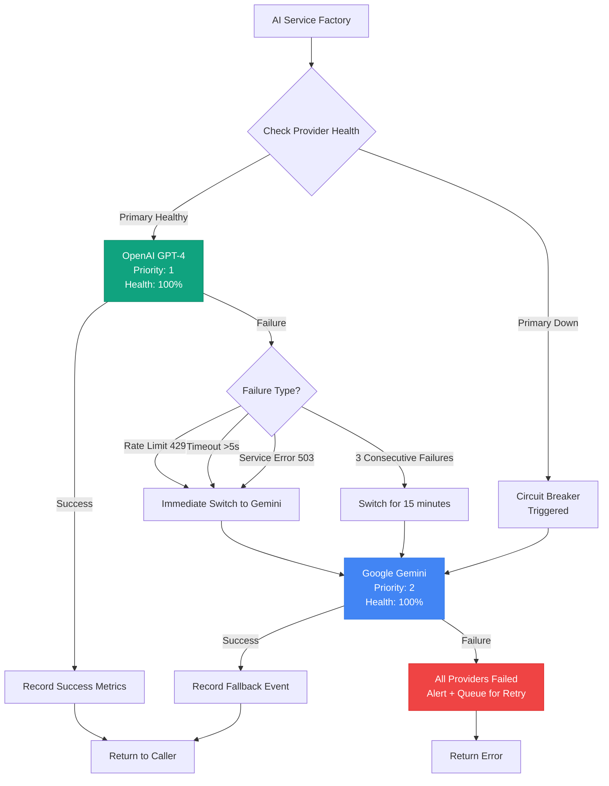
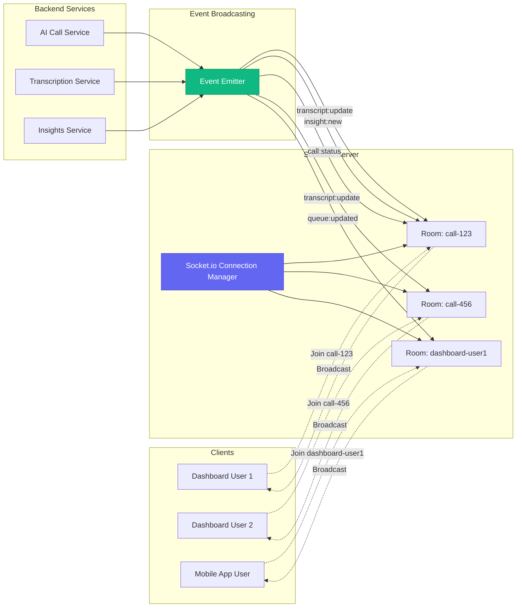
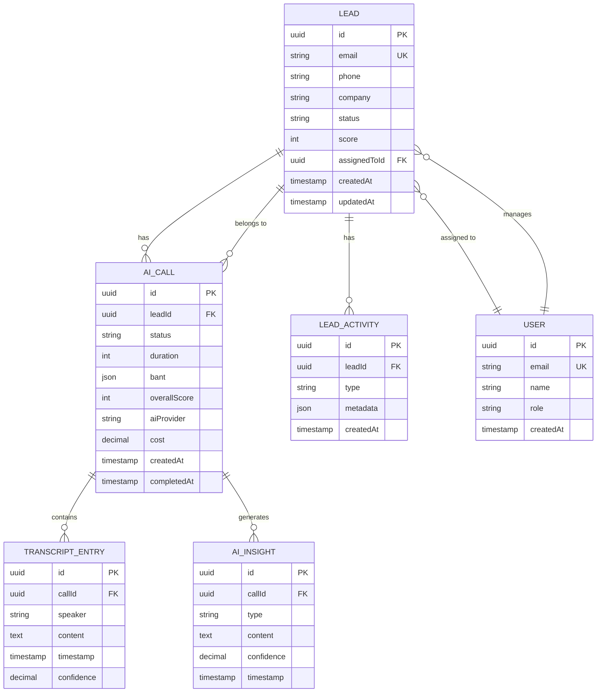
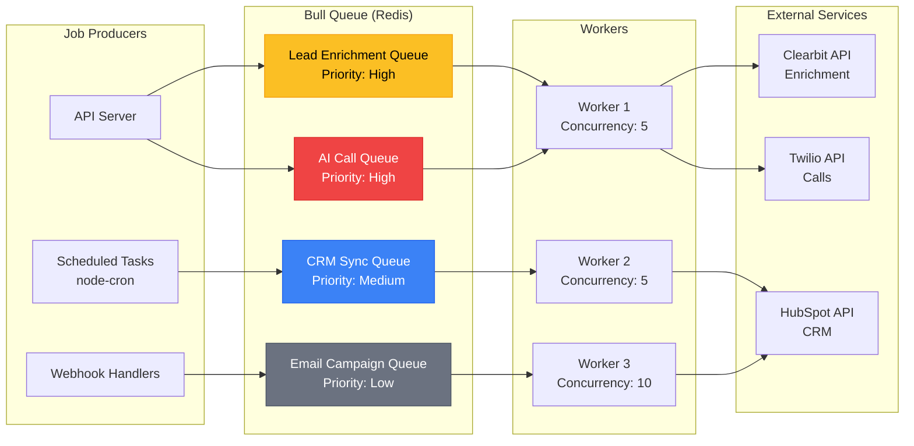
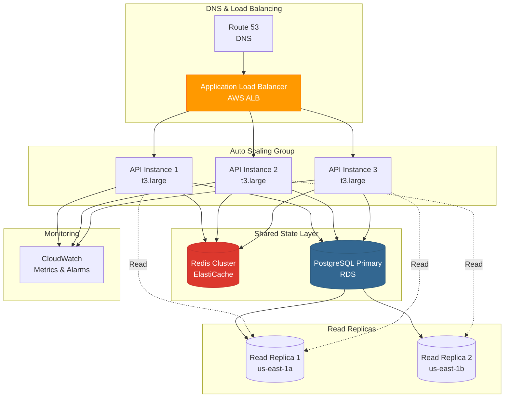
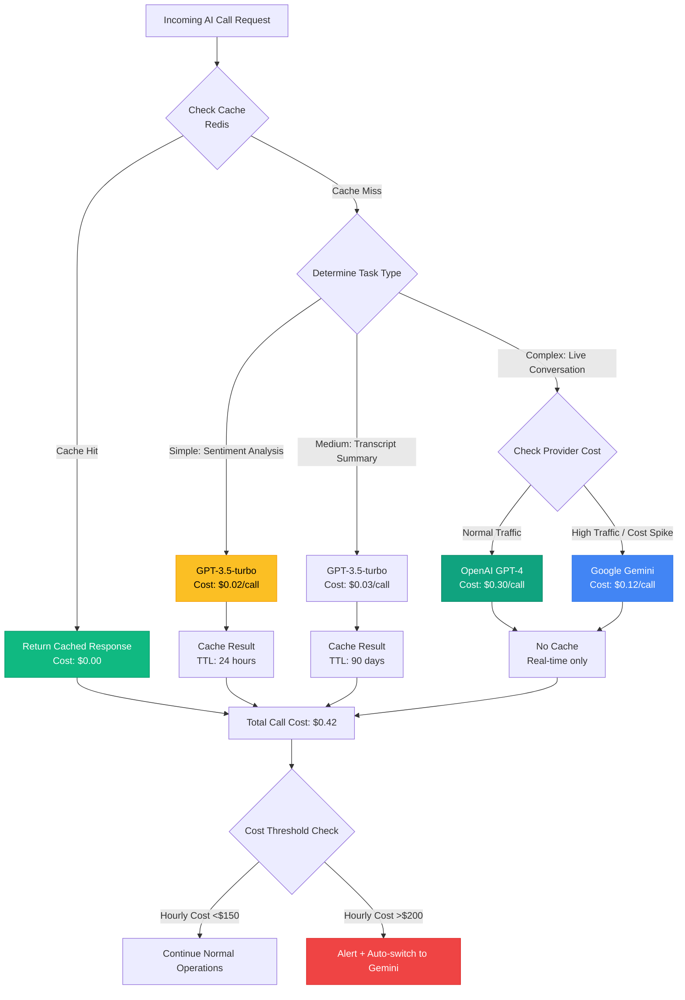

# System Architecture Diagrams

> **Note:** These diagrams use Mermaid syntax and render automatically on GitHub. You can also export them as images using tools like [Mermaid Live Editor](https://mermaid.live/).

---

## 1. High-Level System Architecture



---

## 2. AI Call Flow (Lead Submission → AI Call → CRM Update)



---

## 3. Multi-Provider AI Fallback Architecture



---

## 4. Real-Time WebSocket Architecture



---

## 5. Database Schema (Core Entities)



---

## 6. Background Job Queue Architecture



---

## 7. Horizontal Scaling Architecture



---

## 8. Cost Optimization Flow (AI Calls)



---

## How to Use These Diagrams

### On GitHub
These diagrams render automatically when viewing the Markdown file on GitHub.

### Export as Images
1. Copy the Mermaid code
2. Go to [Mermaid Live Editor](https://mermaid.live/)
3. Paste the code
4. Click "Actions" → "PNG" or "SVG" to download

### Embed in Documentation
Reference from other docs:
```markdown

```

---

## Diagram Legend

| Color | Meaning |
|-------|---------|
| 🟢 Green | Success state, cached data |
| 🔵 Blue | External service, database |
| 🟡 Yellow | Warning, medium priority |
| 🔴 Red | Error state, high priority, alerts |
| 🟣 Purple | Real-time / WebSocket |
| 🟠 Orange | Load balancer, AWS infrastructure |

---

*Last Updated: October 17, 2025*
